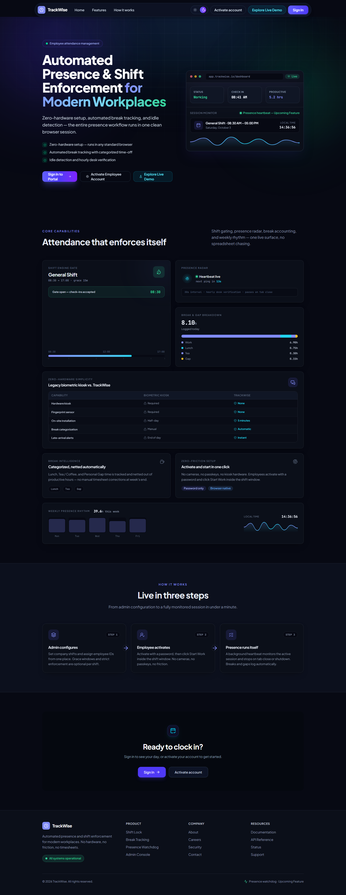
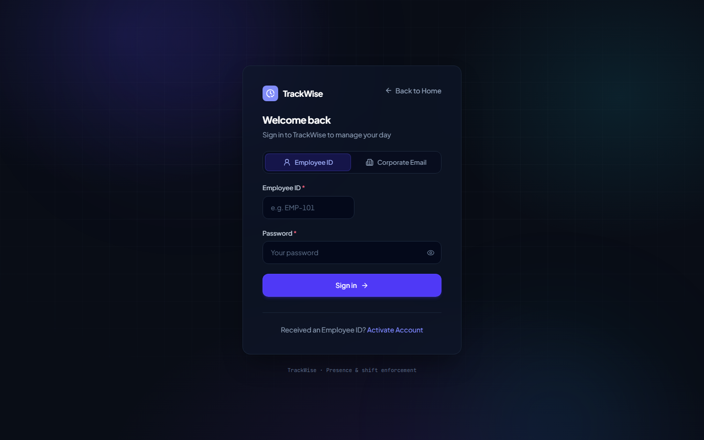
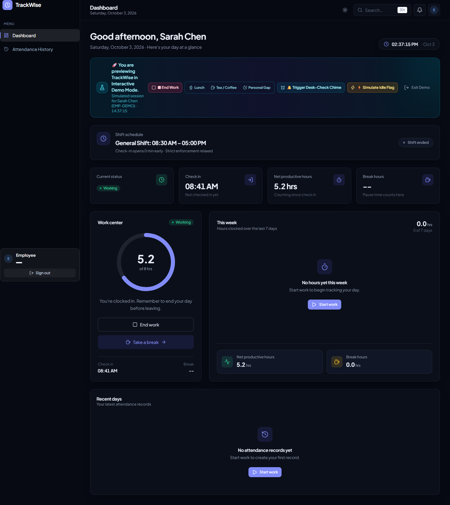
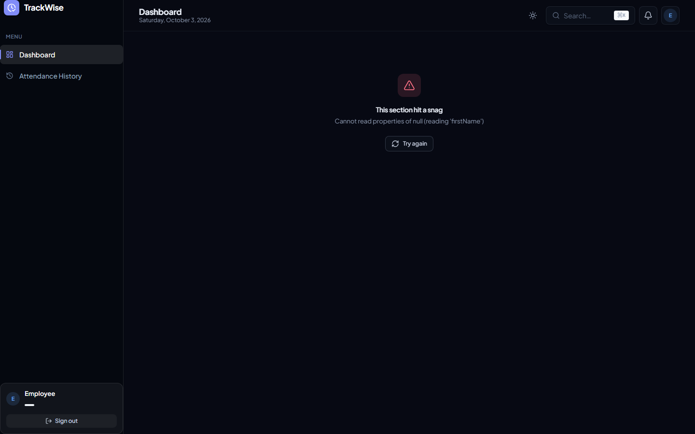

# TrackWise — Modern Workforce Presence & Shift Management Platform

<div align="center">

**Node.js / Express · TypeScript / Drizzle · React / Vite / Tailwind CSS · PostgreSQL**

[](LICENSE)
[](https://nodejs.org/)
[](https://react.dev/)
[](https://www.postgresql.org/)
[](https://expressjs.com/)

</div>

<p align="center">
  <a href="https://trackwise-frontend-tla4.onrender.com" target="_blank" rel="noopener noreferrer">🔗 Live Demo</a>
</p>

<p align="center">
  
</p>

---

## 📖 Overview

TrackWise is a production-grade workforce-presence and shift-management platform. It combines a hardened TypeScript/Express backend (Drizzle ORM, PostgreSQL, JWT auth, strict IDOR guards, rate limiting) with a responsive React 19 front end (Vite, Tailwind CSS v4, ThemeContext with dark mode, and an interactive zero-DB live demo mode). Employees clock in and out in a single idempotent session; admins manage staff, shifts, and presence telemetry from a unified console.

---

## 🏗️ System Architecture

```
┌─────────────────┐     REST (JSON)     ┌──────────────────────┐
│ React 19 (Vite) │ ◄──────────────────► │ Node.js / Express 5 │
│ Tailwind v4     │   Axios interceptors │ TypeScript / Drizzle│
│ ThemeContext    │                      │ PostgreSQL          │
│ Live Demo Mode  │                      │ JWT + bcrypt        │
└─────────────────┘                      │ express-rate-limit  │
        │                                │ IDOR guards         │
        │                                └──────────────────────┘
        │                                         │
        ▼                                         ▼
   Client assets                           modern.users
   docs/screenshots/                        public.users (legacy)
```

- **Frontend**: React 19, Vite 8, Tailwind CSS 4, lucide-react, react-toastify, react-router-dom 7.
- **Backend**: Node.js 20+, Express 5, TypeScript 7, Drizzle ORM 0.45, PostgreSQL 16, `jsonwebtoken`, `express-rate-limit`, `express-validator`, `bcrypt`.
- **Schema**: Dual-schema support (`public.users` legacy + `modern.users` modern) with idempotent bootstrap (`db:setup`).

---

## ✨ Key Features

| Area | Feature | Implementation |
|---|---|---|
| **Auth & Onboarding** | Unified Dual-Schema Auth | Login resolves against `public.users` and `modern.users`; admin account bootstrapped idempotently from `.env` |
| | Self-Activation | Pending employees activate via `/api/auth/activate` with employee ID + custom password |
| **Live Demo** | Zero-DB Interactive Mode | `/dashboard?demo=true` renders a live simulated session with no database writes |
| **Work Sessions** | Idempotent Punch-In | `punchIn()` is idempotent on `(userId, workDate)`; duplicate calls return the same session |
| | Simplified 30-Minute Reminder | Presence reminder fires a dual-tone Web Audio chime (`C5` + `G5`, 220 ms) |
| **Security** | Fail-Fast JWT Guard | Server throws on startup if `JWT_SECRET` is missing or < 32 chars (never defaults to `""`) |
| | Admin Mass-Assignment Fix | `updateEmployee` restricted to `['firstName','lastName','email','phone','department','designation']` |
| | Rate Limiting | `express-rate-limit`: 10 attempts / 15 min per IP on `/api/auth` endpoints |
| | IDOR Protection | `req.user.id` resolved directly from the verified JWT; punch endpoints never read client-supplied identity |
| | Sanitized Logging | No secret leakage; `.env` variables used; `.gitignore` enforces `cc.bat`, `*.bat`, `.backups/`, `*.log` |
| | CORS Allow-Lists | Configurable `CORS_ORIGIN`; production requires it set |
| **Upcoming** | Hardware Telemetry & Presence Radar | Planned features (GPS verification, biometric integration, attendance analytics) |

---

## 📸 Screenshots

### Landing Page

<p align="center">
  
</p>

### Login (Dark Theme)

<p align="center">
  
</p>

### Demo Dashboard (Live Mode)

<p align="center">
  
</p>

### Admin Console

<p align="center">
  
</p>

---

## 🔐 Test Credentials

| Role | Employee ID | Password | Note |
|---|---|---|---|
| Admin | `ADMIN001` | `Admin@12345` | Full dashboard + employee management |
| Employee | `EMP101` | `Welcome@1234` | Activate account before login (if pending) |

These are set via `ADMIN_PASSWORD` / `EMP_PASSWORD` in environment variables and read strictly from `process.env` (no hardcoded fallbacks in `scripts/sync-admin.cjs` or `scripts/quick-activate.cjs`).

---

## 🧪 Local Development Setup

### 1. Prerequisites

- Node.js 20+
- PostgreSQL 14+ running locally (database `trackwise_db` or `DATABASE_URL` set)
- `npm`

### 2. Clone & Install

```bash
git clone https://github.com/Aby020/TrackWise.git
cd TrackWise

# Server
cd server
npm install

# Client (new terminal)
cd ../client
npm install
```

### 3. Configure Environment

```bash
cd server
cp .env.example .env
```

Edit `.env`:

```env
DB_HOST=localhost
DB_PORT=5432
DB_USER=postgres
DB_PASSWORD=<your-db-password>
DB_NAME=trackwise_db
JWT_SECRET=$(node -e "console.log(require('crypto').randomBytes(32).toString('hex'))")
CORS_ORIGIN=http://localhost:5173
ADMIN_EMAIL=admin@trackwise.app
ADMIN_EMPLOYEE_ID=ADMIN001
ADMIN_PASSWORD=Admin@12345
```

Generate a 32+ character JWT secret:

```bash
node -e "console.log(require('crypto').randomBytes(32).toString('hex'))"
```

### 4. Bootstrap Database

```bash
cd server
npm run build
npm run db:setup   # or start server — bootstraps idempotently
```

### 5. Start Servers

```bash
# Backend (terminal 1)
cd server
npm run dev   # http://localhost:5000

# Frontend (terminal 2)
cd client
npm run dev   # http://localhost:5173
```

---

## 🚀 Render Deployment Runbook

### Build

```bash
cd server
npm install
npm run build
```

### Environment Variables (Render Dashboard)

| Key | Value / Note |
|---|---|
| `NODE_ENV` | `production` |
| `PORT` | `5000` (Render provides `PORT` automatically) |
| `DATABASE_URL` | Full PostgreSQL connection string |
| `JWT_SECRET` | 32+ random hex string (must match `.env` secret length) |
| `CORS_ORIGIN` | Your production frontend URL (e.g. `https://trackwise-frontend-tla4.onrender.com`) |
| `ADMIN_EMAIL` | Production admin email |
| `ADMIN_EMPLOYEE_ID` | `ADMIN001` (or custom) |
| `ADMIN_PASSWORD` | Strong admin password (read from env, never hardcoded) |
| `ATTENDANCE_ENFORCE_HOURS` | `true` (default; set `false` only for staging / demos) |

### Start Command (Render)

```bash
npm run prestart && npm start
```

Or directly:

```bash
npm run build && node server.js
```

---

## 🛡️ Security & Audit Remediation

- **Secret Leak & Gitignore**: `cc.bat` removed; `.gitignore` expanded (`cc.bat`, `*.bat`, `.backups/`, `*.log`).
- **Hardcoded Passwords**: `scripts/sync-admin.cjs` and `scripts/quick-activate.cjs` now read `ADMIN_PASSWORD` / `EMP_PASSWORD` strictly from `process.env`; the script exits with error if missing (no fallbacks).
- **Fail-Fast JWT Secret**: `env.ts` throws a fatal startup error if `JWT_SECRET` is missing or < 32 characters; `database/setup.js` defaults to `""` removed.
- **Admin Mass-Assignment Fix (`Rule 6`)**: `updateEmployee` payload sanitized with strict whitelist (`UPDATABLE` array); `role`, `account_status`, and `password` are never permitted through this endpoint.
- **Rate Limiting (`Rule 11`)**: `express-rate-limit` applied on `/api/auth` (10 attempts per 15 minutes per IP).
- **Punch IDOR Protection (`Rule 7`)**: `punch.service.ts` and `attendance.service.js` use `req.user.id` from the verified JWT; no client-supplied identity parameter is consulted for clock-in/clock-out.
- **CORS Allow-Lists**: `CORS_ORIGIN` enforced; production requires it set.
- **Sanitized Logging**: No inline `#` comments in modified code; no hardcoded secrets in repo.

---

## 🏛️ Development Notes

- Type check: `npm run typecheck` (must return 0 errors).
- Client build: `npm run build` (must return 0 errors).
- Zero AI attribution enforced in commit messages.

---

## 🧭 Upcoming Features

- Hardware Telemetry & Radar — GPS-verified presence tracking and real-time workforce heatmap.

---

## 📄 License

MIT License — see [LICENSE](LICENSE).
